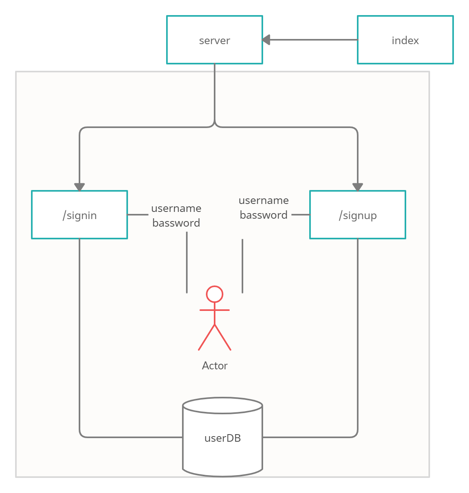

# auth-api

* [GitHub actions](https://github.com/ahmadfrijat/auth-api/actions)
* [pull request](https://github.com/ahmadfrijat/auth-api/pull/1)
* [heroku deployment app](https://ahmad-auth-api.herokuapp.com/)  


# how to work :

* ```npm init -y ```
* ```npm i express dotenv cors morgan mongoose bcrypt base-64 jsonwebtoken ```
* ```npm i -D jest @code-fellows/supergoose ```

# to start mongo server :

* ```sudo service mongod start ```

# UML :

